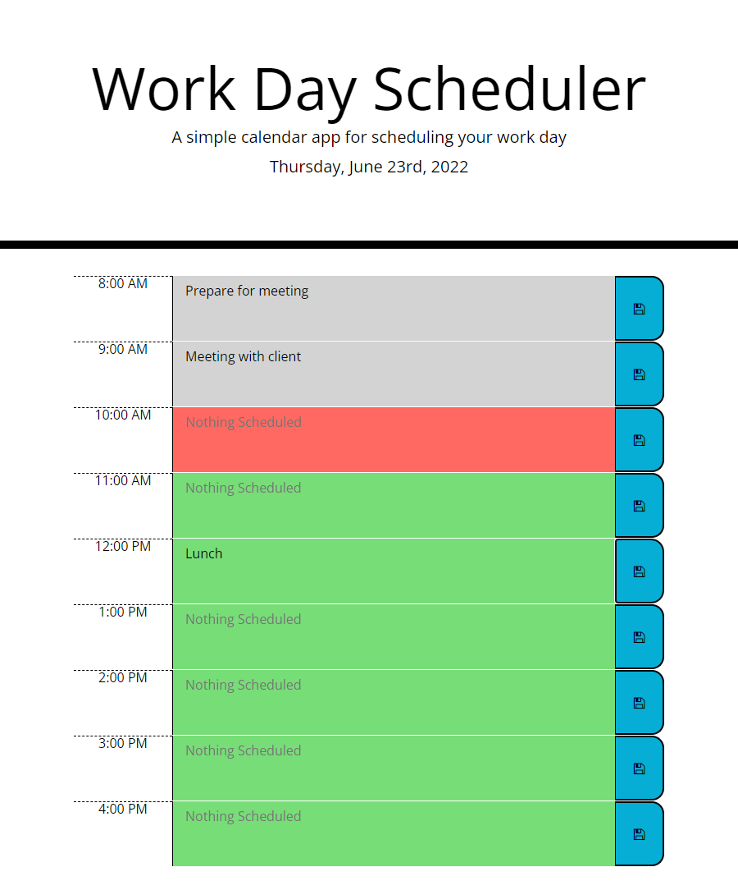

# Work Day Scheduler

```md
This is a simple calendar app for scheduling your workday.
```

## Description

```md
This is a scheduler that has hour blocks for a normal workday schedule (8am - 5pm)
When an hour block is blank, it will tell you that "Nothing is Scheduled"
Each hour block is color coded based on the time of loading the page:
    Grey = Past
    Red = Present
    Green = Future
Changes can be made by updating the text block in the hour block and clicking on save.
The block will outline red if there is an unsaved update.
Data is stored for the next time the user opens the application within that day.

The system is built to allow for a date selector (not added), that the user can update a specific day's schedule.
```




## User Story

```md
AS AN employee with a busy schedule
I WANT to add important events to a daily planner
SO THAT I can manage my time effectively
```

## Acceptance Criteria

```md
GIVEN I am using a daily planner to create a schedule
WHEN I open the planner
THEN the current day is displayed at the top of the calendar
WHEN I scroll down
THEN I am presented with timeblocks for standard business hours
WHEN I view the timeblocks for that day
THEN each timeblock is color coded to indicate whether it is in the past, present, or future
WHEN I click into a timeblock
THEN I can enter an event
WHEN I click the save button for that timeblock
THEN the text for that event is saved in local storage
WHEN I refresh the page
THEN the saved events persist
```

## Getting Started
[Launch Work Day Scheduler](https://dmmerchant.github.io/work-day-scheduler/)

### Dependencies

* Strictly HTML, CSS, and Javascript. No additional additional requirements